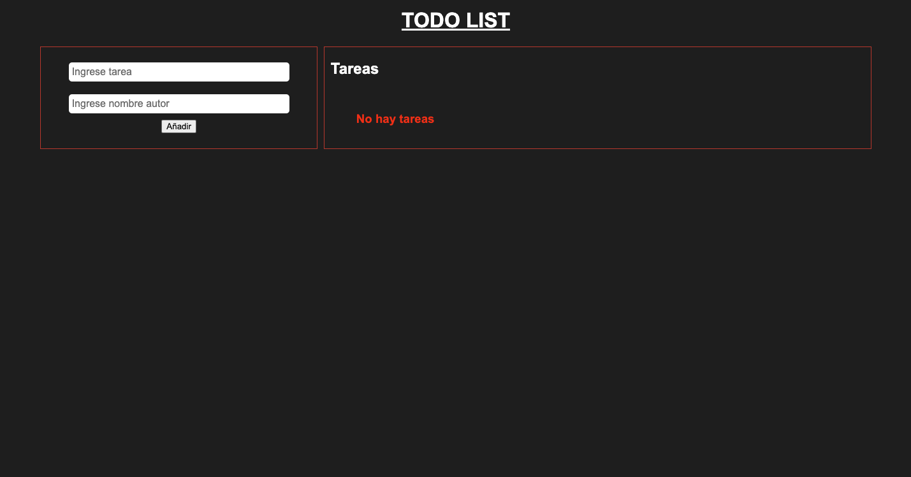
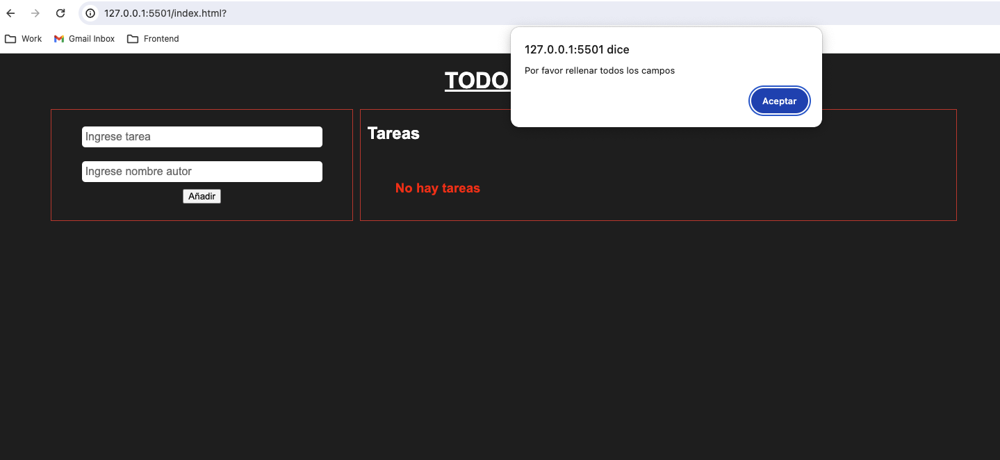
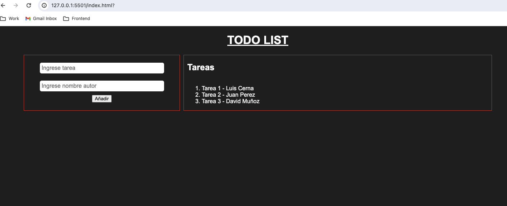

# TODO List

El presente proyecto es una lista de tareas pendientes.

- Al cargar la pagina, se mostrara un formulario a la izquierda para agregar tareas a la lista. Mientras que a la derecha se mostraran las tareas pendientes. 
- Para agregar una tarea, deben llenarse los campos del formulario. Si se envió la petición sin rellenar alguno de los campos, se mostrará un mensaje de error.
- Espacios vacios ingresados al inicio o final de cada uno de los campos son eliminados al momento de enviar la petición.
- Al agregar una tarea nueva, esta se mostrara en la lista de la derecha. El focus vuelve al campo de texto `tarea` con cada tarea agregada exitosamente.
- La lógica del proyecto esta dividida en funciones.
    - `validateForm`: Valida los campos del formulario antes de ser agregados a la lista.
    - `sendTask`: Agrega una nueva tarea a la lista.
    - `clearFields`: Limpia los campos del formulario despues de agregar una nueva tarea exitosamente.
    - `readTask`: Lee el valor del campo de texto tarea.
    - `readAutor`: Lee el valor del campo de texto autor.
    - `showTasks`: Muestra las tareas pendientes en la lista.

## Capturas de pantalla

  

  

